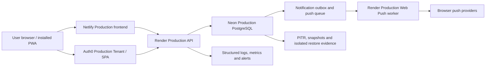

# Production Resource Provisioning Plan — Sprint 36

Date: 2026-08-09

Status: **PLAN COMPLETE / PROVISIONING NOT AUTHORIZED**

Product completion: **98%**
Production readiness: **70% / NOT READY**

This document is a fail-closed execution plan. It does not authorize a resource creation, configuration change, deploy, Migration, restore, DNS change, traffic switch, or Secret access. A human must approve one gate at a time. Staging evidence never substitutes for Production evidence.

## Sprint 37 preflight decision

Sprint 37 revalidated this plan against current repository and external evidence. The order and one-gate authority remain accepted, but the current authorization decision is **NO-GO**. See `docs/PRODUCTION_PROVISIONING_PREFLIGHT_REPORT.md` for the consolidated blocker and classification matrix.

No resource, billing, credential, database, Migration, deployment, DNS, deletion or traffic action occurred. The only next human task is a read-only Auth0 Team plan/Tenant-capacity review; it does not authorize purchase or creation.

## 1. Production resource inventory

| Platform / control | Current evidence | Status | Provisioning implication |
| --- | --- | --- | --- |
| Auth0 Development Tenant and Staging SPA | Existing and verified | PASS (Staging only) | Preserve; never reuse as Production |
| Auth0 Production Tenant / SPA / API | No independent resource is visible; Team tenant limit reached | NOT_CONFIGURED / BLOCKED | Gate A must resolve tenant capacity before creation |
| Neon Production project / branch / `neondb` | Existing; authorized read-only evidence completed | PARTIAL | Preserve the Sprint 34 reader and ACL model; do not create a duplicate database |
| Neon schema / Migration parity | Ledger `0001`–`0008` proved; later application schema not proved/applied | PARTIAL | Gate F remains separate from resource provisioning |
| Neon recovery | PITR available for six hours; snapshots absent; no isolated restore drill | PARTIAL / BLOCKED | Gate B may plan recovery capability; restore execution needs separate approval |
| Neon monitoring / capacity | Required charts and 0.25–2 CU bounds visible; exact headroom not accepted | PARTIAL | Establish thresholds and capacity evidence before traffic |
| Render Staging API | Existing Node service in Singapore | PASS (Staging only) | Preserve; never rename or promote it as Production |
| Render Production API | No independent service or public API URL | NOT_CONFIGURED | Gate C creates a separate service only after A/B prerequisites |
| Netlify project and Deploy Previews | Existing; project has never had a Production Deploy | PASS (Preview only) | Preserve previews; they are not Production evidence |
| Netlify Production frontend / branch / deploy | None | NOT_CONFIGURED | Gate D requires a separately approved Production candidate |
| Production domain / DNS / TLS | No verified Production evidence | UNKNOWN | Gate E; no DNS operation before explicit approval |
| Production monitoring / alerting | Repository telemetry exists; external service evidence absent | BLOCKED | Configure only with the relevant platform gate and prove alerts before traffic |
| Production Web Push / VAPID | Staging architecture accepted; Production key/resource evidence absent | NOT_CONFIGURED | Separate Production VAPID pair and Push worker credential required |
| Production rollback | Runbooks exist; no Production deploy history or isolated restore proof | BLOCKED | Must be rehearsed before Gate G |

## 2. Target Production architecture

The browser receives only public configuration: Production frontend origin, Production API origin, Auth0 issuer/client ID/audience, Workspace scope, build identity, and the VAPID public key. Database URLs, tenant-context HMAC material, VAPID private key, management tokens, and runtime credentials remain server-side protected variables.

### Environment isolation matrix

| Boundary | Staging | Production requirement | Acceptance rule |
| --- | --- | --- | --- |
| Auth0 | Development Tenant / Bankeban Staging SPA and API | Independent Production Tenant, SPA and API | Different issuer, audience, client ID and allowlists |
| Neon | Staging branch/database/roles | Existing Production `neondb` with Production-only roles | No credential or branch reuse; exact host/database guard |
| Render | `bankeban-staging-node-api` | Separate Production API and Push worker/runtime credential | Different service identity, URL, variables and logs |
| Netlify | Draft/Deploy Preview | Production candidate and later Production deploy | Preview URL must never become Production identity |
| VAPID | Staging key pair | Separate Production key pair | Public/private fingerprint parity within Production only |
| CORS / origins | Exact Draft origins | Exact Production frontend origin only | No wildcard and no Staging origin in Production |
| PWA | Staging manifest/storage/cache namespace | Production manifest/storage/cache namespace | Service Worker cannot serve cross-environment assets |
| Monitoring | Staging logs and checks | Production dashboards, alerts and retention | Separate filters, access and evidence |
| Recovery | Staging rollback drills | Production PITR/snapshot policy and isolated restore proof | No destructive restore against live branch |

## 3. Dependency map and provisioning order

The safe dependency order is:

1. **Gate A — Auth0 Production identity capacity and resources.** Establish stable issuer, audience, client ID and exact future origins. No application traffic.
2. **Gate B — Neon Production recovery and capacity readiness.** Preserve the existing database and Sprint 34 roles; establish approved backup/restore and capacity controls. This gate does not apply application Migrations.
3. **Gate C — Render Production API and Push worker.** Create isolated services with protected Production credentials, disabled public traffic except bounded health/readiness validation.
4. **Gate D — Netlify Production frontend candidate.** Create/build the Production candidate with public configuration only. Do not publish traffic.
5. **Gate E — DNS/TLS.** Bind the approved domain only after the frontend/API and Auth0 origin lists are stable. Do not switch user traffic.
6. **Monitoring / logging closure.** Prove health/readiness, structured logs, alert delivery, capacity thresholds, retention and access boundaries.
7. **Gate F — Production Migration.** Only after backup/restore, schema-diff, checksum, rollback/forward-fix and least-privilege evidence are approved.
8. **Production evidence validation.** Re-run public/platform/database validators and record SHA-256 evidence.
9. **Release Gate.** Repository, security, device, operational and rollback gates all PASS.
10. **Gate G — Production traffic.** Owner go/no-go approval; reversible cutover from the current Google Sheets Production path.

The final frontend origin creates a two-pass configuration dependency: reserve/verify the origin without traffic, then add that exact origin to Auth0 and Render before the candidate is exercised. Wildcards and temporary Draft origins are forbidden in Production.

## 4. Phase execution cards

### A. Auth0 Production

- **Prerequisites:** owner approves potential plan/tenant cost and resolves the current tenant-capacity limit; final frontend origin and API audience naming are documented.
- **Resource:** dedicated Production Tenant, SPA Application and API. No Staging Tenant reuse.
- **Configuration:** RS256, PKCE, exact callback/logout/web-origin/CORS lists, refresh/session controls, attack protection, log retention/streaming decision, Production connection policy.
- **Secrets:** SPA client ID is public; management token and any confidential client secret are protected and never enter Git/chat. The browser must not receive a client secret.
- **Read-only/security validation:** issuer discovery, JWKS, audience, signing algorithm, exact allowlists, no Staging origins, and no secret-valued evidence.
- **Rollback:** before traffic, disable the Production SPA/API configuration and retain audit logs; do not delete the Tenant during investigation.
- **PASS:** dedicated resources and every public/security item are independently evidenced.
- **FAIL:** shared Staging identity, wildcard origin, wrong signing algorithm, secret exposure or failed isolation.
- **BLOCKED:** tenant capacity, cost approval, missing owner authority or unknown final origins.

### B. Neon Production

- **Prerequisites:** preserve existing `neondb`, owner/API/migrator/push/read-only role separation and Sprint 34 PASS evidence; approve any paid retention/snapshot capability.
- **Resource:** no duplicate database by default. Provision only recovery/monitoring capacity that the owner separately authorizes.
- **Configuration:** TLS, exact database/host guards, connection limits/timeouts, PITR/snapshot retention, isolated restore target, alert thresholds.
- **Secrets:** five distinct protected credentials where applicable: owner, migrator, API, Push worker and read-only evidence. Never substitute one for another.
- **Read-only/security validation:** role attributes/ACLs, current schema and ledger, capacity, backup policy and catalog-only evidence.
- **Rollback:** configuration rollback to documented previous values; restore drills use an isolated branch, never the live branch.
- **PASS:** capacity is accepted, recovery policy exists, isolated restore proves RPO/RTO, and later Gate F proves schema parity.
- **FAIL:** role reuse, write-capable evidence credential, live-branch restore, unsafe ACL or unreviewed schema drift.
- **BLOCKED:** no budget/authority, missing snapshot capability, no isolated restore target or Migration plan not approved.

### C. Render Production API / Push worker

- **Prerequisites:** Gate A public identity values and Gate B database/security prerequisites; final frontend origin reserved.
- **Resource:** independent Production Node API and separately authorized Push worker execution boundary. Never reuse `bankeban-staging-node-api` as Production.
- **Configuration:** immutable commit/build identity, locked runtime, build/start commands, Singapore or owner-approved region, auto-deploy decision (default off for first release), `/v1/health`, `/v1/readiness`, exact CORS, rate limits, bounded structured logs and alerts.
- **Secrets:** API DB URL, Push DB URL, tenant-context key, VAPID private key and deployment-management token stay protected. Public VAPID key must match the private-key fingerprint.
- **Read-only/security validation:** service metadata, environment-variable presence booleans, readiness build SHA, CORS rejection, least privilege, log redaction and worker delivery evidence.
- **Rollback:** disable/suspend the new service before traffic or redeploy the last accepted immutable commit; preserve logs and queue evidence.
- **PASS:** independent service is healthy/readiness PASS, correctly isolated and observable.
- **FAIL:** Staging credential/origin, secret leak, wrong DB, failed readiness or privileged database role.
- **BLOCKED:** missing Gate A/B evidence, cost approval, protected variables or platform access.

### D. Netlify Production frontend

- **Prerequisites:** accepted Render API origin, Auth0 public config, final Production origin and candidate commit.
- **Resource:** Production frontend deployment context on the existing approved project/site only if the owner confirms that site identity; otherwise stop for explicit site decision.
- **Configuration:** `dataBackend=postgres`, Production API only, Production Auth0 only, Production cache/storage/manifest identity, security headers, public VAPID key and build SHA. No database URL.
- **Secrets:** frontend build receives no database/private VAPID/Auth0 secret. Netlify management token remains operator-only.
- **Read-only/security validation:** asset/config inspection, CSP/security headers, no Staging/placeholder/Google Sheets transport, SPA deep routes and Service Worker cache isolation.
- **Rollback:** retain the current Google Sheets Production path and previous deploy identity; no traffic switch at this gate.
- **PASS:** candidate is immutable, isolated, HTTP/TLS/security checks pass and remains unadvertised.
- **FAIL:** Production context contains Staging URL/credential, Google Sheets fallback, placeholder, secret or cache collision.
- **BLOCKED:** site identity unresolved, missing API/Auth0 configuration, cost/authority or no rollback candidate.

### E. DNS / TLS

- **Prerequisites:** Gates A–D PASS, approved domain/record owner, exact rollback records and a maintenance window.
- **Resource/configuration:** custom domain, DNS records and managed TLS; no wildcard CORS or premature traffic.
- **Secrets:** DNS registrar credentials remain outside the repository and evidence.
- **Validation:** DNS chain, certificate hostname/expiry, HTTPS redirect, HSTS decision, Auth0/Render exact-origin parity.
- **Rollback:** restore the recorded prior DNS values and detach the new domain if validation fails.
- **PASS:** DNS/TLS and all origin lists match with evidence.
- **FAIL:** certificate/origin mismatch, leaked registrar data or unexpected traffic.
- **BLOCKED:** missing domain ownership, approval, rollback values or maintenance window.

### F. Production Migration

- **Prerequisites:** approved Migration manifest/checksums, schema diff, backup and isolated restore PASS, application backward compatibility, maintenance/rollback plan and owner approval.
- **Action:** run only the reviewed tracked Migrations with the dedicated migrator role. `0009`/untracked `0010` remain excluded unless separately reviewed and approved.
- **Validation:** ledger/checksum/schema parity, role grants, RLS, Workspace isolation, smoke/readiness and no unexpected data mutation.
- **Rollback:** use reviewed down Migration only where data-safe; otherwise stop traffic and use the approved forward fix or isolated restore procedure.
- **PASS:** exact schema/ledger and application compatibility evidence pass.
- **FAIL:** checksum drift, unexpected object/ACL, business-data risk or rollback uncertainty.
- **BLOCKED:** recovery evidence incomplete, missing explicit approval, Migration ambiguity or privileged role mismatch.

### G. Production traffic

- **Prerequisites:** every prior gate PASS; monitoring/alerts, real-device matrix, rollback rehearsal, release checklist and owner go/no-go signed.
- **Action:** controlled, observable traffic switch only; no unrelated changes.
- **Validation:** auth, boss/employee isolation, core flows, notification delivery, error/latency/capacity and audit logs.
- **Rollback:** immediately restore the current Google Sheets Production route or last accepted deploy according to the signed decision; preserve evidence.
- **PASS:** acceptance window and rollback criteria stay within thresholds.
- **FAIL:** security, isolation, data integrity, availability or rollback threshold breach.
- **BLOCKED:** any preceding gate is not PASS.

## 5. Human approval gates

At every gate the operator must **STOP** before the action and provide all eight items below.

| Gate | Proposed action | Why | Platform | Possible cost | Staging impact | Production impact | Rollback / required human steps |
| --- | --- | --- | --- | --- | --- | --- | --- |
| A | Resolve tenant limit and create dedicated Production Tenant/SPA/API | Production identity does not exist | Auth0 | Plan/tenant upgrade may cost money; owner must confirm current quote | None | Creates identity resources; no traffic | Record current Team state; create only after approval; disable new app/API if validation fails |
| B | Configure approved Production recovery/capacity resources | Current PITR is short and snapshots/restore evidence are absent | Neon | Retention, snapshots, compute or branch may cost money | None | Configuration/resource change; no business write | Record old values; restore settings; delete only isolated test branch after evidence approval |
| C | Create isolated Production API/Push services | No Production service exists | Render | New services/instances may cost money | None | Creates services and protected variables; no traffic | Auto-deploy off; suspend/disable or redeploy last accepted commit |
| D | Create Production frontend candidate | No Production deploy exists | Netlify | Plan/build/domain features may cost money | None | Candidate deploy only; no traffic | Preserve current Google Sheets path and prior deploy identity |
| E | Configure domain/DNS/TLS | Stable Production origin is required | DNS provider / Netlify | Domain or DNS/TLS plan may cost money | None | Changes routing surface; traffic must remain disabled until Gate G | Export safe old record metadata and restore exact prior records |
| F | Apply reviewed Production Migrations | Production schema is only proved through `0008` | Neon | Operational window/compute may cost money | None | Schema change with data/availability risk | Down/forward-fix/isolated restore path pre-approved; stop on first mismatch |
| G | Enable Production traffic | Final release | Netlify / DNS / Render | Normal Production usage begins | None | User traffic and data begin using new stack | Immediate reversible return to accepted Google Sheets/previous deploy path |

Approval for one gate grants no authority for the next gate.

## 6. Secrets boundary

| Value | Classification | Permitted location | Evidence form |
| --- | --- | --- | --- |
| Auth0 issuer, audience, SPA client ID, JWKS URL | Public configuration | Frontend build and server environment | Exact public URL/identifier |
| VAPID public key | Public configuration | Frontend and server environment | SHA-256 fingerprint / format boolean |
| Auth0 management token/client secret | Secret | Platform/operator secret store only | Presence boolean / masked resource ID |
| Database owner URL | Critical secret | Controlled manual administration only | Presence boolean; never runtime |
| Database migrator URL | Critical secret | One-time approved Migration environment | Presence boolean / role name |
| Database API URL | Critical secret | Render Production API protected variable | Presence boolean / safe host fingerprint |
| Database Push worker URL | Critical secret | Render Push worker protected variable | Presence boolean / role name |
| Database read-only URL | Secret | Evidence process environment only | Presence boolean / verified role metadata |
| Tenant-context HMAC key | Critical secret | Render protected variable and controlled DB key record | Key ID and fingerprint only |
| VAPID private key | Critical secret | Render Push worker protected variable | Public-pair fingerprint only |
| Netlify/Render/DNS operator tokens | Critical secret | Human/platform credential store | Scope and expiry metadata only |

Secrets must never be committed, printed, logged, screenshotted, placed in Markdown/JSON evidence, test fixtures, build assets or browser storage.

## 7. Evidence requirements

Every gate produces sanitized evidence with a timestamp, environment, resource identity, operator/source, status, checks performed, redaction statement, immutable build/Migration identity where applicable, and SHA-256 hash. Allowed evidence is public metadata, masked resource IDs, booleans, counts, fingerprints and bounded status codes. Screenshots must redact hostnames/IDs when they could expose infrastructure or account data.

Status meanings:

- **PASS:** direct, current, authorized evidence satisfies every acceptance criterion.
- **FAIL:** direct evidence violates a criterion; stop and rollback.
- **BLOCKED:** a prerequisite, authority, safe credential or evidence is missing.
- **NOT_CONFIGURED:** the resource/configuration does not exist.
- **UNKNOWN:** current evidence cannot establish existence or state.

Planning documents, repository tests and Staging evidence do not increase Production readiness.

## 8. Cross-layer rollback plan

1. Before traffic, prefer disable/suspend/detach over destructive deletion and retain audit evidence.
2. Keep the current Google Sheets Production route unchanged until Gate G.
3. Pin every candidate to an immutable Git SHA and record Netlify/Render deploy IDs.
4. Keep Auth0, CORS, Session, database role and VAPID boundaries environment-specific; rollback must not reintroduce Staging values.
5. Do not restore into the live Neon branch as a drill. Prove restore on an isolated target and destroy it only after evidence approval.
6. Migration rollback must be pre-reviewed for data safety; otherwise use a forward fix or isolated restore.
7. Define release thresholds for authentication, error rate, latency, connection saturation, queue backlog and notification failure before Gate G.
8. If any security, Workspace isolation, data integrity or rollback control fails, stop traffic and return to the last accepted Production path.

## 9. Sprint 36 decision

The provisioning plan is complete, but no resource is provisioned and no Production gate is accepted. Readiness remains **70% / NOT READY**.

The next single step is **Human Gate A — Auth0 Production tenant-capacity and identity provisioning decision**. The owner must first choose whether to approve the Auth0 plan/tenant capacity change and its current platform cost. Only after that explicit approval may an operator open Auth0 and create the dedicated Production identity resources. No other Production gate may start in parallel.
