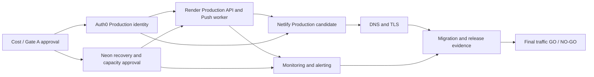

# Production Total Cost Model and Final Gate A Authorization Package

## Sprint 45 exact domain quote addendum

- Owner-selected quote candidate: **`bankeban.com`** (`.com`), Porkbun public unauthenticated search.
- Availability: **AVAILABLE_AT_QUOTE_TIME**. Verisign `.com` RDAP returned HTTP 404 and Porkbun displayed a normal non-Premium registration result.
- Initial registration: **US$11.08 / one year**. Renewal: **US$11.08/year**. Availability and price must be rechecked before any later authorized purchase.
- Known recurring service floor remains **US$49/month / US$588/year**. Adding the current domain quote yields a **US$599.08 first-year/renewal planning floor**, plus Neon/backup usage, monitoring/logging overage, tax where applicable, and other UNKNOWN items.
- This is not a purchase or an exact Production total. Gate A remains **DEFER**, Production Provisioning remains **NO-GO**, and Production Readiness remains **70% / NOT READY**.

日期：2026-08-09

狀態：**SPRINT 45 READ-ONLY DOMAIN QUOTE EVIDENCE COMPLETE / GATE A DEFER / PRODUCTION NO-GO**

產品完成度：**98%**
Production Readiness（正式環境準備度）：**70% / NOT READY**

本文件只整理 Repository（程式碼儲存庫）與官方公開價格／限制證據。它不授權購買、付款、升級、建立資源、修改設定、Deploy（部署）、Migration（資料庫遷移）、DNS 變更、Secret（秘密資訊）操作或 Production（正式環境）流量切換。所有價格均為 2026-08-09 的公開或已授權人工證據；購買前必須重新確認。

## Sprint 44 domain and operations cost evidence addendum

- Repository 內沒有已核准的 Production domain/TLD，因此 domain 首購與續約價格仍為 **UNKNOWN**。Cloudflare Registrar 只列為 at-cost 候選；沒有指定可購買名稱就不能建立 Bankeban 報價。
- Cloudflare authoritative DNS 與 Netlify-managed TLS 均有 US$0 候選，但尚未選定、配置或通過 Production Gate。
- Better Stack Free 是 US$0 的候選最低營運層：10 monitors/heartbeats、1 status page、Slack/email alerts、100,000 exceptions、3 GB logs/3-day retention與30 GB metrics。它未被核准或配置，不能視為 Production capacity PASS。
- 可選的 Better Stack Nano telemetry 公開價為 US$30/月或年繳折算 US$25/月；Responder 為 US$34/月或年繳折算 US$29/月。兩者都不是必要固定成本，也沒有購買授權。
- Render logs 的官方保留為 Hobby 7 天、Pro 14 天、Scale/Enterprise 30 天；Production workspace/service尚未建立，實際方案與成本仍未成立。
- Neon Free 的六小時 PITR 仍為 PARTIAL；scheduled snapshot未配置。Snapshot storage公開單價為US$0.09/GB-month，paid history storage為US$0.20/GB-month；實際用量、隔離 Restore與演練工時均UNKNOWN。

更新後最低成本仍只能表達為 **US$49/month / US$588/year known fixed + Domain + Neon/backup usage + operations overage + other UNKNOWN items**。候選 Free tiers不會把未知成本變成零。詳見`docs/PRODUCTION_DOMAIN_OPERATIONS_COST_EVIDENCE.md`。Gate A維持**DEFER**，Production維持**NO-GO**。

## Sprint 43 Neon actual-plan evidence addendum

- Current actual Neon organization plan is **Free / US$0 fixed monthly plan fee**.
- Free inclusions shown per project are 0.5 GB storage, autoscaling to 2 CU, 100 compute hours and 10 branches.
- Organization-wide usage since 2026-08-01 is 10.77 CU-hours, 0.08 GB storage, 0 GB history and 0.3 GB network transfer. These values cover all projects and cannot be assigned to Production.
- Production project 32.84 MB and Staging project 46.01 MB are project-screen observations, not billing GB-month.
- Production-only compute, billing storage, network transfer, snapshot storage and estimated/charged amount remain UNKNOWN.
- The public Neon US$15/month workload example remains a future paid-planning anchor only; it is not the current plan fee or current charge.

The known fixed Production planning floor therefore remains **US$49/month / US$588/year plus Neon future architecture and other unknowns**. Current Neon Free / US$0 account evidence does not prove the Free plan is safe for Production, and it does not convert the total into US$49 exact. Gate A remains **DEFER** and Production remains **NO-GO**.

## Sprint 42 Gate A blocker closure addendum

The cost model is unchanged: Minimum fixed known remains US$49/month (US$588/year), the Neon US$15/month workload example produces only an indicative US$64/month (US$768/year) plus unknowns, and the exact total remains unknown.

`docs/PRODUCTION_GATE_A_BLOCKER_CLOSURE_PLAN.md` identifies the remaining decision evidence and downstream gates. No new external evidence or owner budget acceptance exists, so Gate A remains **DEFER**, not `CONDITIONAL GO` or `GO`. No Production or billing action occurred.

## Sprint 41 Production Cost Finalization（正式環境成本最終確認）

Sprint 41 重新稽核 Sprint 40 的人工證據及 Auth0、Neon、Render、Netlify、Cloudflare、Netlify TLS 與外部監控的官方公開資料。結論採 fail-closed：公開單價可以建立規劃公式，但沒有帳戶實際 Usage/Billing（用量／帳務）證據時，不能把變動成本填成 US$0，也不能宣稱得到精確總價。

### 已驗證的計價事實

- Auth0 Essentials：US$35/月、3 Tenants；目前仍是獨立 Production Tenant 的最低已證明候選。
- Render：API Starter 與 Push Worker Starter 仍各以 US$7/月作既有已驗證 compute 規劃值。Render Hobby workspace 可為 US$0，但 Pro workspace 的 US$25/月與 audit logs／較長留存只屬建議營運能力，不是目前最低必要固定費。
- Netlify：目前帳戶 Free、US$0、每月 300 credits；額度耗盡時站台會暫停至下個週期或升級，因此成本為零不代表容量風險為零。
- Neon：Launch 為 usage-based（用量計價），公開費率為 US$0.106/CU-hour、資料儲存 US$0.35/GB-month、restore history US$0.20/GB-month；官方 US$15/月只是 140 CU-hours＋1 GB 的 intermittent-load（間歇負載）範例。不能當成本專案固定最低費。
- Neon recovery：Launch 最多 7 天 restore window；scheduled snapshots 只在付費方案提供。Snapshot storage 自 2026-05-01 起公開價為 US$0.09/GB-month。現有 Production 人工證據只有 6 小時 PITR、無 schedule、無 snapshot、無隔離 Restore；帳戶方案與實際費用仍未證明。
- Domain：必須先選 TLD 與 registrar；費用依 registry／ICANN 與續約條件，維持 UNKNOWN。
- DNS：Cloudflare Free／Pro／Business 的 authoritative DNS query 可為 US$0，但尚未選定或配置。
- TLS：Netlify-managed certificate 對所有 Netlify sites 免費；實際 Production domain／certificate 尚未配置，因此能力成本可為零但 Gate 未通過。
- Monitoring／Alerting：Render email／Slack failure notifications 與 provider dashboards 可作零額外固定費基線；外部監控候選的 Free tier 可提供有限 uptime checks／email 或 Slack 告警。實際 provider、接收人、留存、升級與 on-call 方案尚未選定，不能將正式營運成本宣稱為零。

### 三種最終成本模型

| 模型 | 固定已知月／年成本 | 可用的公開規劃錨點 | Variable Cost | Unknown Cost | 判定 |
| --- | --- | --- | --- | --- | --- |
| A. Minimum Production | **US$49/月；US$588/年** | 加 Neon 官方典型 US$15/月後為約 **US$64/月；US$768/年** | Neon CU/storage/history/snapshot、Render/Netlify usage | Domain、稅、隔離 Restore、告警／日誌超額 | 不是精確總價；只可表達為 US$49＋變動／未知 |
| B. Recommended Production | **US$67/月；US$804/年** | 加 Neon 官方典型 US$15/月後為約 **US$82/月；US$984/年** | 同 A；另可能包含 Netlify 或 Render 營運升級 | Domain、外部 on-call／長期 logs、DR 演練、稅 | 保留較高 API instance；升級仍需獨立證據與授權 |
| C. Growth Production | **UNKNOWN** | 可參考 Neon Scale 官方典型 US$701/月，但不得視為 Bankeban 報價或最低費 | Auth0 MAU、Neon CU/storage/history/egress、Render instances/bandwidth、Netlify credits | 支援、SLA、合規、集中監控、Domain、稅 | 只有成長觸發條件，無可信月／年總價 |

Scenario A/B 的年度數字只把已知固定月費乘以 12；沒有把 UNKNOWN 當 US$0。Neon US$15 只列為 planning anchor（規劃錨點），不列入「已知固定成本」。Scenario C 若沒有實際 MAU、流量、資料量、CU-hours、保留期與 SLO，就必須維持 UNKNOWN。

### Sprint 41 Gate A 決策

- Gate A：**DEFER**，不是 APPROVE 或 CONDITIONAL APPROVE。
- 理由：雖然固定已知下限已收斂，但 Neon 現行 plan／完整 billing period 用量、Domain 價格、監控／告警選型、備份／隔離 Restore 成本仍缺帳戶級或採購級證據；Production 也仍為 NO-GO。
- APPROVE proposal 的最低前置：owner 接受完整的「US$49/月固定下限＋Neon 與 Unknown」成本邊界，並在平台 UI 重新確認 Neon、Auth0、Domain 與監控選型；任何付款或資源建立仍須另一個明確授權。
- Production Readiness 維持 **70% / NOT READY**，不得因成本文件完成而調分。

## Sprint 40 Netlify Billing Evidence（帳務證據，歷史基線）

Owner 於 2026-08-09 唯讀確認 Netlify Usage & billing：目前為 **Free / Credit-based / US$0 fixed monthly cost / 300 credits per month**。Jul 14–Aug 13 期間已使用 `274.6 / 300` credits，剩餘 `25.4`，約 91.5%；其中 18 次被帳務分類為 Production deploys，共使用 270 credits，約佔總用量 98.3%。Web requests 約 20,188、約 4 credits；bandwidth 約 30.7 MB、約 0.6 credits；Compute 與 AI inference 為 0。

這是 account-level billing evidence（帳戶層級帳務證據），不是 Bankeban Production Deploy PASS。既有 Netlify Project 仍沒有經批准的正式部署；不得因帳務分類名稱為 `Production deploys` 而改寫既有 Production Evidence。

Free plan 的 `no overage charges` 只證明目前不會產生 overage charge，不代表 credits 耗盡後沒有容量、建置或服務中斷風險。Netlify 因此是 **candidate zero-cost component（可能為零成本的候選項目）＋ unresolved capacity risk（未解容量風險）**。

## 1. 證據與計價原則

- **FREE**：目前可證明無固定訂閱費，但仍可能有配額、用量或功能限制。
- **REQUIRED_PAID**：現有安全／隔離架構要上線時，至少需要付費能力。
- **OPTIONAL_PAID**：可改善容量、留存或維運，但不是目前已證明的最低必要條件。
- **UNKNOWN**：無法從官方公開資料與現有帳戶證據得到專案實際費用。
- **DEFERRED**：本次不購買、不啟用，待 Gate（閘門）核准。
- Monthly（每月）、Annual（每年）與 One-time（一次性）分開；用量型價格不冒充固定月費。
- 未知價格或帳戶適用性一律標示 **UNVERIFIED / RECONFIRM BEFORE PURCHASE**。

官方公開來源：

- Auth0：<https://auth0.com/pricing>、<https://auth0.com/docs/troubleshoot/customer-support/manage-subscriptions>
- Neon：<https://neon.com/pricing>、<https://neon.com/docs/ai/ai-database-versioning>
- Render：<https://render.com/docs/free>、<https://render.com/articles/render-vs-railway>、<https://render.com/docs/service-types>
- Netlify：<https://docs.netlify.com/manage/accounts-and-billing/billing/billing-for-credit-based-plans/credit-based-pricing-plans/>
- Cloudflare DNS／Registrar：<https://developers.cloudflare.com/dns/faq/>、<https://developers.cloudflare.com/registrar/>

## 2. Production Cost Inventory（正式環境成本清單）

| Platform / capability | 分類 | Monthly | Annual | One-time | 證據與限制 |
| --- | --- | ---: | ---: | ---: | --- |
| Auth0 Production Tenant / SPA / API | REQUIRED_PAID / DEFERRED | **US$35** Essentials | **US$420** | US$0 已知 | 官方頁面與 Sprint 38 人工證據均顯示 Essentials 為 US$35/月、3 Tenants；Free 只有既有 Development Tenant，無法滿足隔離。購買前重查方案、稅與地區計價。 |
| Auth0 Professional | OPTIONAL_PAID | US$240 | US$2,880 | UNKNOWN | 目前沒有功能或容量證據證明需要；不是 Gate A 建議方案。 |
| Neon current organization plan | FREE / capacity PARTIAL | **US$0 fixed plan fee** | **US$0 fixed plan fee** | US$0 | 人工唯讀證據；組織用量不可拆成 Production-only，Free capacity/recovery 尚未通過 Production Gate。 |
| Neon future Production architecture | REQUIRED capability / future plan UNKNOWN | **UNKNOWN**；官方 Launch 典型範例 US$15/月 | UNKNOWN | UNKNOWN | US$15 是公開規劃範例，不是目前費用或 Bankeban 報價。Production-only CU、storage、history、snapshot、network 與 charge 均 UNKNOWN。 |
| Neon scheduled snapshots | REQUIRED capability / cost UNKNOWN | UNKNOWN | UNKNOWN | UNKNOWN | Scheduled backups 需付費方案；snapshot storage 官方標示 US$0.09/GB-month（2026-05-01 起）。目前 Production 未啟用、無 snapshot。 |
| Neon PITR / restore history | REQUIRED capability / PARTIAL | 含於方案與用量，實際 UNKNOWN | UNKNOWN | Restore drill 成本 UNKNOWN | 現有人工證據只有 6 小時 PITR；尚未達既定 RPO/RTO 證據，也未執行隔離 restore。 |
| Render Production API Starter | REQUIRED_PAID | **US$7** | **US$84** | US$0 已知 | Free instance 官方明示不適合 Production。Starter 公開價 US$7/月；實際頻寬、build pipeline 與稅未知。 |
| Render Push Worker Starter | REQUIRED_PAID | **US$7** | **US$84** | US$0 已知 | 既有架構要求獨立 Push Worker；background worker 為獨立付費 service。 |
| Render API Standard | OPTIONAL_PAID / recommended | US$25（取代 API Starter） | US$300 | US$0 已知 | 建議小型商業情境預留較高資源；是否必要須以 Staging 容量證據決定。 |
| Netlify current Free plan | FREE candidate / capacity UNRESOLVED | **US$0** | **US$0** | US$0 | Owner evidence: Credit-based、300 credits/month、目前 274.6 used、25.4 remaining。可列入最低固定成本，但不能宣稱容量足夠。 |
| Netlify future paid upgrade | OPTIONAL_PAID / DEFERRED | **UNKNOWN / RECONFIRM BEFORE PURCHASE** | UNKNOWN | UNKNOWN | 只有 Production 實際用量證明 Free 不足時才提出獨立升級 Gate；Personal/Pro 公開價不得當作目前固定成本。 |
| Production domain | REQUIRED_PAID | 月均 UNKNOWN | **UNKNOWN** | 註冊／轉移 UNKNOWN | 必須先選定 TLD 與 registrar。Cloudflare Registrar 不加價但 registry/ICANN 成本依 TLD；不可先填假價格。 |
| DNS | FREE candidate | US$0 | US$0 | US$0 | Cloudflare Free DNS 不收 DNS query 費；是否採用仍需 owner 明確批准與 DNS rollback 計畫。 |
| TLS | FREE candidate | US$0 | US$0 | US$0 | Netlify 所有方案支援 managed SSL；實際 domain 綁定與 certificate 證據仍不存在。 |
| Monitoring / alerting | REQUIRED capability / PARTIAL | Better Stack Free US$0 candidate；paid responder可選US$34/月或年繳折算US$29/月 | Paid responder年繳候選US$348/年 | Usage/人工作業UNKNOWN | Public candidate已證明；Production alert delivery、data handling、named responder、retention與capacity尚未核准或配置。 |
| Logging / retention | REQUIRED capability / PARTIAL | Free 3 GB/3-day candidate；Nano US$30/月或年繳折算US$25/月；overage另計 | Nano年繳候選US$300/年 | ingestion US$0.10/GB、retention US$0.05/GB-month、query boost US$0.001/GB scanned | Render 7/14/30-day plan retention與Neon Launch 3-day UI logs已記錄；actual Production plan/volume未建立。 |
| Backup / restore / DR drill | REQUIRED capability / PARTIAL/BLOCKED | Snapshot US$0.09/GB-month；paid history US$0.20/GB-month | UNKNOWN | Isolated branch/compute/storage/labor UNKNOWN | 六小時PITR不等於完整DR；scheduled snapshot未配置且isolated Restore未執行。 |
| Web Push provider transport | FREE | US$0 已知 | US$0 已知 | US$0 | 標準 Web Push/FCM transport 本身目前無獨立供應商訂閱；Push Worker compute 已在 Render 列入。 |
| External alerting service | OPTIONAL_PAID / UNKNOWN | UNKNOWN | UNKNOWN | UNKNOWN | 未選供應商、方案或配額；購買前另做官方證據與隱私審查。 |

## 3. 三種成本情境

### Scenario 1 — Minimum Safe Production（最低安全正式環境）

必須保留獨立 Auth0 Production Tenant、獨立 Render API/Push Worker、Production PostgreSQL、HTTPS、監控／告警、備份／隔離 Restore、回滾與 Release Gate，不能為省錢取消。

| Component | 規劃值 |
| --- | ---: |
| Auth0 Essentials | US$35/月 |
| Render API Starter | US$7/月 |
| Render Push Worker Starter | US$7/月 |
| Netlify current Free candidate | US$0/月 |
| **已知固定下限** | **US$49/月；US$588/年** |
| Neon Launch 官方典型範例（非固定下限） | 約 US$15/月 |
| **指標性規劃值** | **約 US$64/月；US$768/年** |
| 仍須加上 | Neon 實際用量／snapshot、domain、監控告警、logging overage、restore drill、Render/Netlify overage、稅 |

因此本情境不是精確 Total（總價）；其安全表達為：**已知固定下限 US$49/月＋Neon 與其他 Unknown items（未知項目）**。若以 Neon 官方案例暫作預算，則為 **US$64/月＋未知項目**。Netlify US$0 只是目前帳戶候選，不等於容量 Gate PASS。

### Scenario 2 — Recommended Small Business Production（建議小型商業正式環境）

| Component | 規劃值 |
| --- | ---: |
| Auth0 Essentials | US$35/月 |
| Render API Standard | US$25/月 |
| Render Push Worker Starter | US$7/月 |
| Netlify current Free candidate | US$0/月；容量未證明 |
| Netlify future paid capacity | UNKNOWN；不納入目前固定成本 |
| **已知固定規劃值** | **US$67/月；US$804/年** |
| Neon Launch 官方典型範例（非固定下限） | 約 US$15/月 |
| **指標性規劃值** | **約 US$82/月；US$984/年＋Netlify 未來可能升級成本** |
| 仍須加上 | 與 Scenario 1 相同的所有未知用量、domain、DR、alerting、overage 與稅 |

這個情境優先保留較有餘裕的 API instance；Netlify 是否需要付費必須由真實穩態 Production credit 使用量決定，不預先硬編碼 Personal 或 Pro。

### Scenario 3 — Growth Production（成長後正式環境）

- Auth0 Essentials 在 MAU／Tenant／Action／log 要求不足時，才重新評估 Professional；目前不建議預購。
- Neon 依 CU、storage、history、metrics/log retention 與 restore 經驗升級；官方 Scale 典型範例不適合作為本專案現階段固定預算。
- Render 依 API latency、memory、queue depth 與 worker throughput 垂直／水平擴充。
- Netlify 依 credits、bandwidth、requests、team/audit 要求升級。
- 監控、集中 logging 與 on-call 工具只有在保留期、告警可靠性或合規證據要求出現時導入。

本情境只是一條升級路徑，沒有足夠證據計算可信總價。

### Netlify Scenario A — Free 足以支撐低量 Production

- Production 正常發佈目標不超過每個 billing period 4 次（60 credits）。
- 保留至少 60 credits 給緊急 rollback、必要 hotfix 與流量用量。
- 每週檢視 credits；70% 使用量發出內部 warning，尚不能因此宣稱 Production Gate PASS。

### Netlify Scenario B — Free 可用但部署紀律不足

- 目前 18 deploys 已使用 270 credits，是 300 credits 的 90%，亦是本期總用量約 98.3%。
- 正常目標仍是每 period 4 次；含緊急發佈的管理上限為 8 次（120 credits）。
- 合併變更、先完成 Staging/Draft acceptance、只有 release candidate 才進 Production context。
- 75% 使用量（225 credits）停止非必要 deploy；85%（255 credits）進入 release freeze；緊急修正需 owner 單次批准並保留 rollback credits。
- Preview/Draft 是否也消耗 account credits 必須由 Usage 頁持續確認，不能假設免費。

### Netlify Scenario C — Production 用量證明 Free 不足

- 只有排除開發／重複 deploy 後，穩態 Production traffic、必要 deploy 與 rollback reserve 仍超過 300 credits，才能提出 paid upgrade Gate。
- 提案必須帶 current quote、included credits、auto-recharge/overage、downgrade、billing cycle 與停機風險；本 Sprint 不選方案、不升級。

## 4. Billing（計費）、取消與成本風險

| Area | 已驗證事實 | 風險／後續 |
| --- | --- | --- |
| Auth0 | 官方文件支援 self-service upgrade/downgrade，Free 可作為取消 paid subscription 的降級方向；提供 monthly/annual 選項 | 購買前確認立即生效／下期生效、Tenant/resource retention、credit/refund、稅與付款方式；**USER VERIFICATION REQUIRED** |
| Neon | Launch/Scale 依 compute、storage、history 等用量計價；restore history 與 snapshot storage 會影響成本 | 缺少實際 CU-hours、storage、history/snapshot 預估；overage 與 restore 演練費用 **UNVERIFIED** |
| Render | Instance 依 service 分開計費；API 與 Push Worker 各自佔 instance；可能有 egress/build overage | Cancellation/downgrade 對 availability/retention 的實際影響 **USER VERIFICATION REQUIRED** |
| Netlify | Owner evidence confirms Free / Credit-based / US$0 / 300 credits; current period uses 274.6 credits, primarily 18 deploys | `no overage charges` 不等於無容量風險。先執行部署預算與穩態用量觀察；只有證明不足才提出付費 Gate。 |
| Domain | 年度續費與 transfer 依 TLD/registrar | 過期會中斷 DNS/TLS/登入 origin；需列 owner、auto-renew、付款與 recovery。價格 **UNKNOWN** |
| Vendor lock-in | Auth0 issuer/Actions、Neon branch/PITR、Render services、Netlify deploy/credits 都有平台特定操作 | 保留 OIDC/JWKS 標準邊界、PostgreSQL dump/restore、可重建 build、DNS rollback 與 provider-independent runbook；不在本 Sprint 執行遷移 |

## 5. Provisioning Dependencies（建置相依性）

專案既有 Gate A-G 次序維持：身份與容量 → Neon recovery/capacity → Render → Netlify → DNS/TLS → monitoring closure → Migration → evidence/release → traffic。每個 Gate 需要獨立授權，不能繼承。

### Auth0 繼續 DEFER 時仍可安全準備

- Runbook、RPO/RTO、monitoring/alert matrix、incident owner 與 escalation plan。
- Production public/private environment-variable inventory（只列名稱與責任，不填值）。
- DNS record/TTL/rollback 計畫與 domain owner 清單。
- Migration/schema parity 的唯讀差異分析與 checksum 計畫。
- Netlify/Render build、health、readiness、rollback acceptance checklist。
- Staging 容量測試與 cost telemetry（不得冒充 Production）。
- 重新確認各平台公開價格與 account entitlement。

### Auth0 DEFER 時必須停止

- Production Tenant/SPA/API、issuer/audience/client ID 建立。
- Render Production Auth0/JWKS/session/CORS 最終設定與 public acceptance。
- Netlify Production Auth0 public config、正式登入與端到端 Session 驗收。
- Production deploy、Migration、DNS traffic、real user cutover、Gate G。

## 6. Final Gate A Authorization Package（最終 Gate A 授權包）

### 建議：**DEFER**

1. **現在是否值得開始固定支出？** 尚未。Product 已接近完成，但 Production 整體仍 NOT READY；Netlify/Render 正式資源、Neon schema/recovery、domain、monitoring/alerting、rollback 與 exact billing 尚未閉合。
2. **Auth0 是否應升級？** 架構上，若決定開始正式建置，Essentials 是目前已證明能提供 3 Tenants 的最低候選；現在不建議執行 upgrade。
3. **批准後第一個真正操作？** 先由 owner 明確批准 Auth0 Essentials 固定費與獨立 Production Tenant；只有之後另一個逐步授權，才可購買並建立 Tenant。不能同時授權 SPA/API、Render、Netlify 或 DNS。
4. **最低已知固定成本？** US$49/月、US$588/年，加 Neon 實際用量與所有未知項目；用官方案例暫估為約 US$64/月、US$768/年加未知項目。
5. **未知成本？** Neon Production-only用量/snapshot/restore與future safe plan、domain、監控告警、logging、Render overage、Netlify 未來容量升級、tax。Neon與Netlify current fixed cost均已收斂為 US$0，但兩者的Production容量均未收斂。
6. **下一次必要明確授權？** 先只授權 Gate A 的 exact plan、monthly/annual billing、Tenant ownership/recovery、取消/降級影響與 stop conditions；任何購買或建立資源仍須在授權文字中明列。

### APPROVE 的必要前置（尚未滿足）

- Owner 接受「US$49/月固定下限＋未知成本」而非只接受 Auth0 US$35。
- 在平台 UI 重新確認 Auth0 Essentials 價格、Tenant entitlement、billing cycle、downgrade/cancellation 和 Tenant retention。
- 以部署預算觀察 Netlify 穩態 credits，並確認 Neon 預估用量與備份成本、domain/registrar、monitoring/alerting 選型。
- 明確列出 Gate A 只建立 dedicated Production Tenant，不會自動觸發 Gate B-G。

## 7. Final status

- Sprint 41 Production Cost Finalization：**COMPLETE AS FAIL-CLOSED DECISION PACKAGE**
- Sprint 40 Netlify 帳務／成本收斂：**COMPLETE / HISTORICAL BASELINE**
- Sprint 43 Neon current plan／organization usage收斂：**COMPLETE / PARTIAL EVIDENCE ONLY**
- Gate A：**DEFER / NOT AUTHORIZED**
- Production provisioning：**NO-GO**
- Production readiness：**70% / NOT READY（不因文件完成而提高）**
- Production / billing / platform mutation：**NONE**
- Sprint 44 Domain/operations public evidence：**COMPLETE / EXTERNAL GATES STILL PARTIAL**。
- Sprint 45 exact domain quote evidence：**COMPLETE / DOMAIN OWNERSHIP AND DNS STILL NOT CONFIGURED**。
- 唯一下一個 Sprint：**Sprint 46 Production Schema Parity Read-only Plan**。不得連線 Production、執行 SQL 或 Migration。
