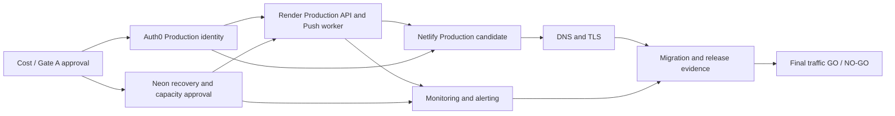

# Production Total Cost Model and Final Gate A Authorization Package

日期：2026-08-09

狀態：**SPRINT 39 COMPLETE AS COST/AUTHORIZATION PREPARATION / GATE A DEFER / PRODUCTION NO-GO**

產品完成度：**98%**
Production Readiness（正式環境準備度）：**70% / NOT READY**

本文件只整理 Repository（程式碼儲存庫）與官方公開價格／限制證據。它不授權購買、付款、升級、建立資源、修改設定、Deploy（部署）、Migration（資料庫遷移）、DNS 變更、Secret（秘密資訊）操作或 Production（正式環境）流量切換。所有價格均為 2026-08-09 的公開或已授權人工證據；購買前必須重新確認。

## 1. 證據與計價原則

- **FREE**：目前可證明無固定訂閱費，但仍可能有配額、用量或功能限制。
- **REQUIRED_PAID**：現有安全／隔離架構要上線時，至少需要付費能力。
- **OPTIONAL_PAID**：可改善容量、留存或維運，但不是目前已證明的最低必要條件。
- **UNKNOWN**：無法從官方公開資料與現有帳戶證據得到專案實際費用。
- **DEFERRED**：本次不購買、不啟用，待 Gate（閘門）核准。
- Monthly（每月）、Annual（每年）與 One-time（一次性）分開；用量型價格不冒充固定月費。
- 未知價格或帳戶適用性一律標示 **UNVERIFIED / RECONFIRM BEFORE PURCHASE**。

官方公開來源：

- Auth0：<https://auth0.com/pricing>、<https://auth0.com/docs/troubleshoot/customer-support/manage-subscriptions>
- Neon：<https://neon.com/pricing>、<https://neon.com/docs/ai/ai-database-versioning>
- Render：<https://render.com/docs/free>、<https://render.com/articles/render-vs-railway>、<https://render.com/docs/service-types>
- Netlify：<https://docs.netlify.com/manage/accounts-and-billing/billing/billing-for-credit-based-plans/credit-based-pricing-plans/>
- Cloudflare DNS／Registrar：<https://developers.cloudflare.com/dns/faq/>、<https://developers.cloudflare.com/registrar/>

## 2. Production Cost Inventory（正式環境成本清單）

| Platform / capability | 分類 | Monthly | Annual | One-time | 證據與限制 |
| --- | --- | ---: | ---: | ---: | --- |
| Auth0 Production Tenant / SPA / API | REQUIRED_PAID / DEFERRED | **US$35** Essentials | **US$420** | US$0 已知 | 官方頁面與 Sprint 38 人工證據均顯示 Essentials 為 US$35/月、3 Tenants；Free 只有既有 Development Tenant，無法滿足隔離。購買前重查方案、稅與地區計價。 |
| Auth0 Professional | OPTIONAL_PAID | US$240 | US$2,880 | UNKNOWN | 目前沒有功能或容量證據證明需要；不是 Gate A 建議方案。 |
| Neon Production database | REQUIRED_PAID capability / usage-based | **UNKNOWN**；官方 Launch 典型範例 US$15/月 | UNKNOWN | UNKNOWN | Launch 為用量計價；US$15 是官方「典型間歇工作負載」範例，不是固定最低費。實際 CU、storage、history、egress 必須重新估算。 |
| Neon scheduled snapshots | REQUIRED capability / cost UNKNOWN | UNKNOWN | UNKNOWN | UNKNOWN | Scheduled backups 需付費方案；snapshot storage 官方標示 US$0.09/GB-month（2026-05-01 起）。目前 Production 未啟用、無 snapshot。 |
| Neon PITR / restore history | REQUIRED capability / PARTIAL | 含於方案與用量，實際 UNKNOWN | UNKNOWN | Restore drill 成本 UNKNOWN | 現有人工證據只有 6 小時 PITR；尚未達既定 RPO/RTO 證據，也未執行隔離 restore。 |
| Render Production API Starter | REQUIRED_PAID | **US$7** | **US$84** | US$0 已知 | Free instance 官方明示不適合 Production。Starter 公開價 US$7/月；實際頻寬、build pipeline 與稅未知。 |
| Render Push Worker Starter | REQUIRED_PAID | **US$7** | **US$84** | US$0 已知 | 既有架構要求獨立 Push Worker；background worker 為獨立付費 service。 |
| Render API Standard | OPTIONAL_PAID / recommended | US$25（取代 API Starter） | US$300 | US$0 已知 | 建議小型商業情境預留較高資源；是否必要須以 Staging 容量證據決定。 |
| Netlify Personal | REQUIRED_PAID candidate | **US$9** | **US$108** | US$0 已知 | Credit-based Personal 有 1,000 credits 與自動加購；適合作為最低非硬停機候選。現有帳戶是 legacy 或 credit-based 尚未證明。 |
| Netlify Pro | OPTIONAL_PAID / recommended | US$20 起 | US$240 起 | US$0 已知 | 3,000 credits、audit logs、shared environment variables、30-day analytics；用量超額成本 UNKNOWN。 |
| Production domain | REQUIRED_PAID | 月均 UNKNOWN | **UNKNOWN** | 註冊／轉移 UNKNOWN | 必須先選定 TLD 與 registrar。Cloudflare Registrar 不加價但 registry/ICANN 成本依 TLD；不可先填假價格。 |
| DNS | FREE candidate | US$0 | US$0 | US$0 | Cloudflare Free DNS 不收 DNS query 費；是否採用仍需 owner 明確批准與 DNS rollback 計畫。 |
| TLS | FREE candidate | US$0 | US$0 | US$0 | Netlify 所有方案支援 managed SSL；實際 domain 綁定與 certificate 證據仍不存在。 |
| Monitoring / alerting | REQUIRED capability / UNKNOWN | UNKNOWN | UNKNOWN | UNKNOWN | Provider metrics 可作基線，但 Production alert delivery、on-call channel、retention 與 responder 尚未配置。外部 Sentry／PostHog／其他告警未選型。 |
| Logging / retention | REQUIRED capability / PARTIAL | 方案內＋UNKNOWN overage | UNKNOWN | UNKNOWN | Auth0 Essentials 5-day log retention/1 stream；Neon Launch 3-day metrics/logs；Render retention/streaming的帳戶實價需人工確認。 |
| Backup / restore / DR drill | REQUIRED capability / UNKNOWN | UNKNOWN | UNKNOWN | UNKNOWN | Snapshot storage、隔離 branch/compute、演練工時與保留策略尚未估價；不得以 PITR available 冒充完整 DR PASS。 |
| Web Push provider transport | FREE | US$0 已知 | US$0 已知 | US$0 | 標準 Web Push/FCM transport 本身目前無獨立供應商訂閱；Push Worker compute 已在 Render 列入。 |
| External alerting service | OPTIONAL_PAID / UNKNOWN | UNKNOWN | UNKNOWN | UNKNOWN | 未選供應商、方案或配額；購買前另做官方證據與隱私審查。 |

## 3. 三種成本情境

### Scenario 1 — Minimum Safe Production（最低安全正式環境）

必須保留獨立 Auth0 Production Tenant、獨立 Render API/Push Worker、Production PostgreSQL、HTTPS、監控／告警、備份／隔離 Restore、回滾與 Release Gate，不能為省錢取消。

| Component | 規劃值 |
| --- | ---: |
| Auth0 Essentials | US$35/月 |
| Render API Starter | US$7/月 |
| Render Push Worker Starter | US$7/月 |
| Netlify Personal candidate | US$9/月 |
| **已知固定下限** | **US$58/月；US$696/年** |
| Neon Launch 官方典型範例（非固定下限） | 約 US$15/月 |
| **指標性規劃值** | **約 US$73/月；US$876/年** |
| 仍須加上 | Neon 實際用量／snapshot、domain、監控告警、logging overage、restore drill、Render/Netlify overage、稅 |

因此本情境不是精確 Total（總價）；其安全表達為：**已知固定下限 US$58/月＋Neon 與其他 Unknown items（未知項目）**。若以 Neon 官方案例暫作預算，則為 **US$73/月＋未知項目**。

### Scenario 2 — Recommended Small Business Production（建議小型商業正式環境）

| Component | 規劃值 |
| --- | ---: |
| Auth0 Essentials | US$35/月 |
| Render API Standard | US$25/月 |
| Render Push Worker Starter | US$7/月 |
| Netlify Pro | US$20/月起 |
| **已知固定規劃值** | **US$87/月；US$1,044/年** |
| Neon Launch 官方典型範例（非固定下限） | 約 US$15/月 |
| **指標性規劃值** | **約 US$102/月；US$1,224/年** |
| 仍須加上 | 與 Scenario 1 相同的所有未知用量、domain、DR、alerting、overage 與稅 |

這個情境優先保留 Netlify audit/analytics 與較有餘裕的 API instance；仍須用容量測試決定 Render Standard 是否必要。

### Scenario 3 — Growth Production（成長後正式環境）

- Auth0 Essentials 在 MAU／Tenant／Action／log 要求不足時，才重新評估 Professional；目前不建議預購。
- Neon 依 CU、storage、history、metrics/log retention 與 restore 經驗升級；官方 Scale 典型範例不適合作為本專案現階段固定預算。
- Render 依 API latency、memory、queue depth 與 worker throughput 垂直／水平擴充。
- Netlify 依 credits、bandwidth、requests、team/audit 要求升級。
- 監控、集中 logging 與 on-call 工具只有在保留期、告警可靠性或合規證據要求出現時導入。

本情境只是一條升級路徑，沒有足夠證據計算可信總價。

## 4. Billing（計費）、取消與成本風險

| Area | 已驗證事實 | 風險／後續 |
| --- | --- | --- |
| Auth0 | 官方文件支援 self-service upgrade/downgrade，Free 可作為取消 paid subscription 的降級方向；提供 monthly/annual 選項 | 購買前確認立即生效／下期生效、Tenant/resource retention、credit/refund、稅與付款方式；**USER VERIFICATION REQUIRED** |
| Neon | Launch/Scale 依 compute、storage、history 等用量計價；restore history 與 snapshot storage 會影響成本 | 缺少實際 CU-hours、storage、history/snapshot 預估；overage 與 restore 演練費用 **UNVERIFIED** |
| Render | Instance 依 service 分開計費；API 與 Push Worker 各自佔 instance；可能有 egress/build overage | Cancellation/downgrade 對 availability/retention 的實際影響 **USER VERIFICATION REQUIRED** |
| Netlify | Credit-based plan依 deploy、bandwidth、requests 消耗；Personal 可 auto-recharge；Pro downgrade 通常下期生效；legacy 轉 credit-based 不可逆 | 目前帳戶計價模式未知；先確認 current plan、legacy/credit-based 與近 30 日 credits，才可選 $9/$20 |
| Domain | 年度續費與 transfer 依 TLD/registrar | 過期會中斷 DNS/TLS/登入 origin；需列 owner、auto-renew、付款與 recovery。價格 **UNKNOWN** |
| Vendor lock-in | Auth0 issuer/Actions、Neon branch/PITR、Render services、Netlify deploy/credits 都有平台特定操作 | 保留 OIDC/JWKS 標準邊界、PostgreSQL dump/restore、可重建 build、DNS rollback 與 provider-independent runbook；不在本 Sprint 執行遷移 |

## 5. Provisioning Dependencies（建置相依性）

專案既有 Gate A-G 次序維持：身份與容量 → Neon recovery/capacity → Render → Netlify → DNS/TLS → monitoring closure → Migration → evidence/release → traffic。每個 Gate 需要獨立授權，不能繼承。

### Auth0 繼續 DEFER 時仍可安全準備

- Runbook、RPO/RTO、monitoring/alert matrix、incident owner 與 escalation plan。
- Production public/private environment-variable inventory（只列名稱與責任，不填值）。
- DNS record/TTL/rollback 計畫與 domain owner 清單。
- Migration/schema parity 的唯讀差異分析與 checksum 計畫。
- Netlify/Render build、health、readiness、rollback acceptance checklist。
- Staging 容量測試與 cost telemetry（不得冒充 Production）。
- 重新確認各平台公開價格與 account entitlement。

### Auth0 DEFER 時必須停止

- Production Tenant/SPA/API、issuer/audience/client ID 建立。
- Render Production Auth0/JWKS/session/CORS 最終設定與 public acceptance。
- Netlify Production Auth0 public config、正式登入與端到端 Session 驗收。
- Production deploy、Migration、DNS traffic、real user cutover、Gate G。

## 6. Final Gate A Authorization Package（最終 Gate A 授權包）

### 建議：**DEFER**

1. **現在是否值得開始固定支出？** 尚未。Product 已接近完成，但 Production 整體仍 NOT READY；Netlify/Render 正式資源、Neon schema/recovery、domain、monitoring/alerting、rollback 與 exact billing 尚未閉合。
2. **Auth0 是否應升級？** 架構上，若決定開始正式建置，Essentials 是目前已證明能提供 3 Tenants 的最低候選；現在不建議執行 upgrade。
3. **批准後第一個真正操作？** 先由 owner 明確批准 Auth0 Essentials 固定費與獨立 Production Tenant；只有之後另一個逐步授權，才可購買並建立 Tenant。不能同時授權 SPA/API、Render、Netlify 或 DNS。
4. **最低已知固定成本？** US$58/月、US$696/年，加 Neon 實際用量與所有未知項目；用官方案例暫估為約 US$73/月、US$876/年加未知項目。
5. **未知成本？** Neon 實際用量/snapshot/restore、domain、監控告警、logging、Render/Netlify overage、tax，以及 current Netlify billing model。
6. **下一次必要明確授權？** 先只授權 Gate A 的 exact plan、monthly/annual billing、Tenant ownership/recovery、取消/降級影響與 stop conditions；任何購買或建立資源仍須在授權文字中明列。

### APPROVE 的必要前置（尚未滿足）

- Owner 接受「US$58/月固定下限＋未知成本」而非只接受 Auth0 US$35。
- 在平台 UI 重新確認 Auth0 Essentials 價格、Tenant entitlement、billing cycle、downgrade/cancellation 和 Tenant retention。
- 確認 Netlify current billing model/plan、Neon預估用量與備份成本、domain/registrar、monitoring/alerting 選型。
- 明確列出 Gate A 只建立 dedicated Production Tenant，不會自動觸發 Gate B-G。

## 7. Final status

- Sprint 39 文件／成本盤點：**COMPLETE**
- Gate A：**DEFER / NOT AUTHORIZED**
- Production provisioning：**NO-GO**
- Production readiness：**70% / NOT READY（不因文件完成而提高）**
- Production / billing / platform mutation：**NONE**
- 唯一下一個人工動作：在 Netlify 的 Billing / Plan details 唯讀確認目前帳戶是 Legacy 或 Credit-based、目前方案及近 30 日 credits；不要 upgrade、add payment、switch plan 或 deploy，回報非敏感的 plan 名稱、billing model 與 credits 數字。
